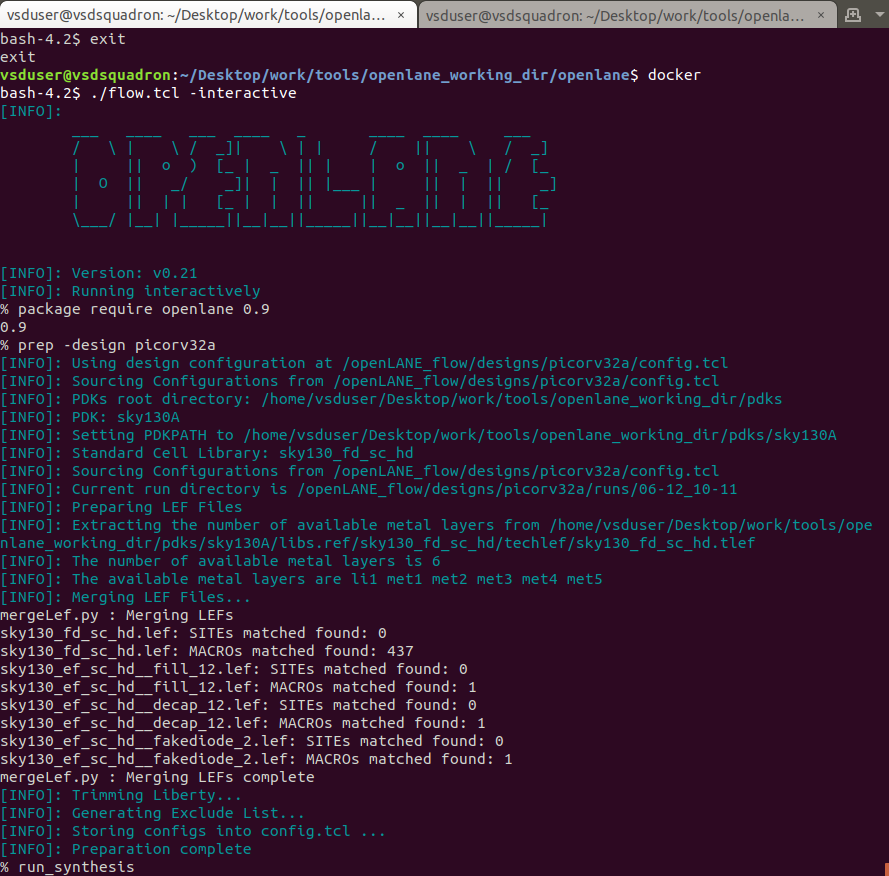
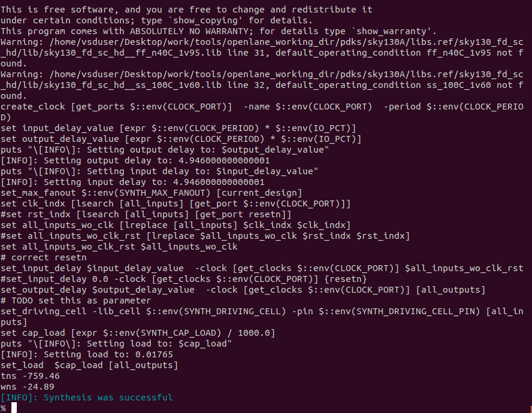
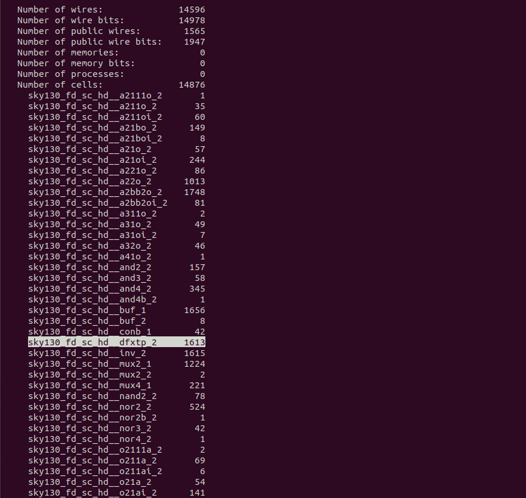

# Digital VLSI & SoC Design and PLanning

## Lab 1: Intro to OpenLane flow
<details>
  <summary>
Expand
  </summary>

  The first Lab's aim is to run syntheis and other steps for the `picorv32a` design.

  Also, we have to calculate the flop ratio. 
  ```math 
  Flop\ Ratio = \frac{Number\ of\ D\ FlipFlops}{Total\ Number\ of\ Cells} 
  ```
  Steps:
- first, we start the OpenLane flow
```
# navigating to the correct directory
$ cd Desktop/work/tools/openlane_working_dir/openlane

$ docker

# starting the OpenLane flow, inthe interactive mode 
$ ./flow.tcl -interactive
$ package require openlane 0.9

$ prep -design picorv32a

$ run_synthesis
```



The above screenshots show the commands entered, and the succesful completion of the synthesis steps. Below are some details that we receive form this step, showing the number of components used.



The highligte line `sky130_fd_sc_hd__dfxtp_2` shows the number of D-FlipFlops. using this the flop ratio can be calculated.
```math
Flop\ Ratio = \frac{1613}{14876} = 0.108429685
Thus,\ Percentage\ of\ DFFs = 0.108429685 * 100 = 10.84%
```
</details>

## Lab 2: 
<details>
  <summary>
Expand
  </summary>


</details>

## Lab 3: 
<details>
  <summary>
Expand
  </summary>


</details>

## Lab 4: 
<details>
  <summary>
Expand
  </summary>


</details>

## Lab 5: 
<details>
  <summary>
Expand
  </summary>


</details>